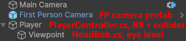

# Immersive First Person Movement for Unity

Immersive First Person Movement for Unity (IFPM4U) consists of two scripts (and a useful component) for realistic feeling movement, making walking in a 3D game much more enjoyable and enhancing immersion. This is perfect for horror games or walking sims. Some of these features can be found in AAA games like Resident Evil.

## Features

* **Walk cycle dips**
  * These are dips in move speed when a foot hits the ground.
  * Modern Resident Evil games all use this.
* **Head bob**
  * Moves in a u-shaped pattern (configureable curves)
  * Also rotates the camera for stabilization since in real life your eyes would lock onto a point in front of you.
  * Synced with walk cycle of course.
* **Less control over sharp turns**
  * The player has less control over move direction the higher the turn angle is between each step.
  * The walk cycle speed will increase if the player is trying to make a sharp turn, meaning the current foot will hit the ground quicker to be able to change direction.
  * The walk cycle dip will also feel stronger to give the impression of stopping momentum.
  * Feels like you're actually using your legs to rotate your body.
* **Slight forward camera offset**
  * Your eyes are not at the center of your body, so the camera should be offset forward.
* **Dominant leg**
  * One leg feels very slightly stronger than the other.
  * Could also be used for limping.
* **Slight randomization**
  * Some aspects such as the walk cycle interval are slightly randomized for a more natural feel.
* **Acceleration**
  * So you don't immediately start moving at full speed.
  * Configureable curve and speed
* **CinemachineRotationOffset component**
  * No idea why Cinemachine doesn't have this

https://github.com/user-attachments/assets/6ade41ad-9772-43fd-ab67-80dfb9c8ca30

https://github.com/user-attachments/assets/64de9c02-4761-4225-a7ae-9c4cb1d1583c

## Setup

1. [Download and import NaughtyAttributes](https://github.com/dbrizov/NaughtyAttributes)
2. Install Cinemachine (Package Manager -> Unity Registry)
3. [Download the latest realase](https://github.com/Squirrel404/RFPM4U/releases) and import it into your project
4. Scene setup (prefab found in IFPM4U folder):

 Note: if the prefab has a missing script, replace that with the CinemachineCameraOffset script.

5. Insert the Viewpoint game object as tracking target on the Cinemachine Camera and press "Add Brain"

To change the controls, open the MovementInput input actions.

To apply rotation offset to the camera, add another CinemachineRotationOffset component to the First Person Camera game object.
Make sure you reference to the right component! You can differentiate CinemachineRotationOffset components in code using their tag variable. Alternatively, you could create a rotation offset manager that adds components on Awake and stores them in a Dictionary.
